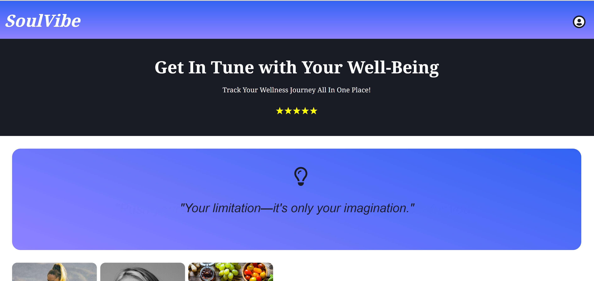

# SoulVibe

Flask React fullstack health tracking application

## Live Site

- **Open SoulVibe:** [SoulVibe](https://soulvibe.onrender.com)

## Technologies Used

### Frontend
- Javascript
- React
- Redux

### Backend
- PostgreSQL
- Python
- Flask
- SQLAlchemy

## To Get Started

1. Clone this repository (only this branch)

2. Install dependencies

      ```bash
      pipenv install -r requirements.txt
      ```

3. Create a **.env** file based on the example with proper settings for your
   development environment

4. Setup your PostgreSQL credentials and database according to the variables set in .env.

5. This starter organizes all tables inside the `flask_schema` schema, defined
   by the `SCHEMA` environment variable.  Replace the value for
   `SCHEMA` with a unique name, **making sure you use the snake_case
   convention**.

6. Get into your pipenv, migrate your database, seed your database, and run your Flask app

   ```bash
   pipenv shell
   ```

   ```bash
   flask db upgrade
   ```

   ```bash
   flask seed all
   ```

   ```bash
   flask run
   ```

7. To run the React App in development, checkout the [README](./react-app/README.md) inside the `react-app` directory.

8. The application will now be running at [http://localhost:3000/](http://localhost:3000/).


## Functionality & MVPs

In **SoulVibe**, users can:

- **Authenticate:**
  - Sign up, log in, use a Demo User feature, and log out.

- **Journal Activities:**
  - View, create, edit, and delete journal entries, including mood tracking.

- **Nutrition & Meal Planning:**
  - View, add, edit, and delete nutrition entries, detailing meals and food types.

- **Exercise Tracking:**
  - Log, view, edit, and delete exercise activities, specifying type, duration, and intensity.

- **Meditation Practices:**
  - Record, view, edit, and delete meditation sessions.

- **Resource Hub:**
  - Access a variety of wellness resources including articles and videos.


## Implementation Highlights

### Splash Page


### Sign Up Modal


### Nutrition Page


### Journal Page


## Future Features

This site is still being updated and completed. Future features will include:
- Reminder notifications
- Future meal and exercise scheduling
- More comprehensive resource page with API
